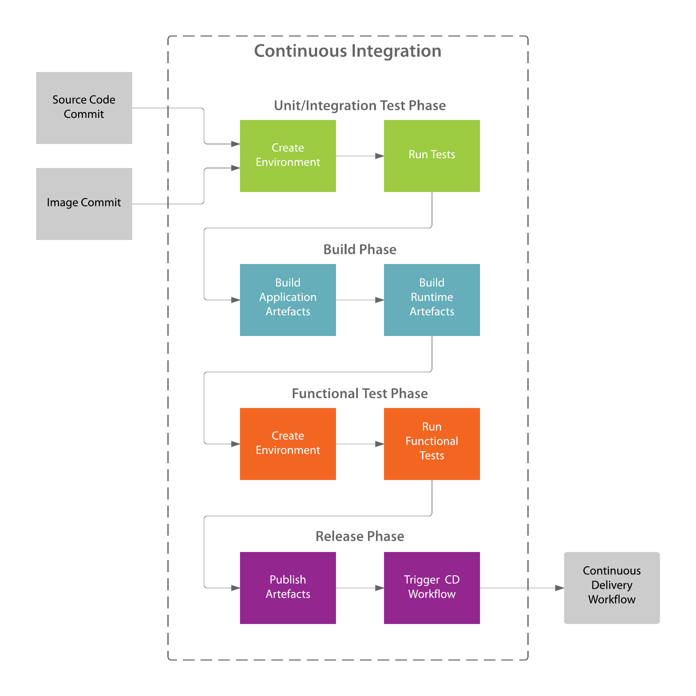

.. _Introduction:

Introduction
============

PyPackage Docker is a tool set for packaging Python and Django applications using Docker and Wheels.

Workflow
--------

|workflow|

Methodology
-----------

* Create deployable and versionable application artefacts (i.e. Python wheels)
* Create deployable and versionable operating environment artefacts (i.e. Docker images)
* Leverage Python standards and existing toolsets (``pip`` and ``virtualenv``) as much as possible
* Reduce build times by using cacheable pre-built application artefacts (i.e. Python wheels)

Prerequisites
-------------

PyPackage Docker uses a ``Makefile`` which restricts use to OS X and Linux.

PyPackage Docker requires the following:

* A Python application(s) to package
* Docker daemon (local or remote)
* Docker client 

PyPackage Docker was created and tested against Docker version 1.8.2.

Simplifying the Developer Experience
------------------------------------

All of the various tasks of building images, building packages and running release and development containers are performed using the ``docker`` command line tool.

The ``docker`` tool generally requires a number of inputs, which make it harder for new users to pick up quickly.

PyPackage Docker includes a |makefile| that simplifies the commands required to execute each of the various tasks to simple ``make`` commands.

.. |makefile| raw:: html

  <a href="https://github.com/cloudhotspot/pypackage-docker/blob/master/Makefile" target="_blank">Makefile</a>

Acknowledgements
----------------

Inspiration and ideas for this project were drawn from the following sources:

* |docker_deploy_double_dutch|
* |make_docker_command|
* |docker_workflow_with_make_command|
* |virtualenv_lives|

.. |docker_deploy_double_dutch| raw:: html

  <a href="https://glyph.twistedmatrix.com/2015/03/docker-deploy-double-dutch.html" target="_blank">https://glyph.twistedmatrix.com/2015/03/docker-deploy-double-dutch.html</a>

.. |make_docker_command| raw:: html

  <a href="http://marmelab.com/blog/2014/09/10/make-docker-command.html" target="_blank">http://marmelab.com/blog/2014/09/10/make-docker-command.html</a>

.. |docker_workflow_with_make_command| raw:: html

  <a href="http://www.itnotes.de/docker/development/tools/2014/08/31/speed-up-your-docker-workflow-with-a-makefile/" target="_blank">http://www.itnotes.de/docker/development/tools/2014/08/31/speed-up-your-docker-workflow-with-a-makefile/</a>

.. |virtualenv_lives| raw:: html

  <a href="https://hynek.me/articles/virtualenv-lives/" target="_blank">https://hynek.me/articles/virtualenv-lives/</a>
